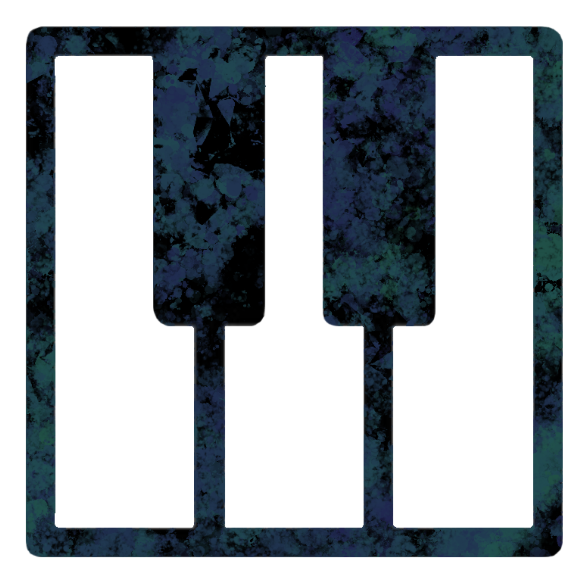

<a id="readme-top"></a>
<!-- PROJECT SHIELDS -->
<!--
*** I'm using markdown "reference style" links for readability.
*** Reference links are enclosed in brackets [ ] instead of parentheses ( ).
*** See the bottom of this document for the declaration of the reference variables
*** for contributors-url, forks-url, etc. This is an optional, concise syntax you may use.
*** https://www.markdownguide.org/basic-syntax/#reference-style-links
-->

<!-- PROJECT LOGO -->
<br />
<div align="center">
  <a href="https://github.com/othneildrew/Best-README-Template">
    
  </a>

  <h3 align="center">Bach 2 Basics</h3>

  <p align="center">
    Enhancing learning, muscle memory, and intuitive piano practice experience
    <br />
    <a href="https://github.com/whoisjoshua/bach2basics/blob/main/ui_demo/demo/README.md"><strong>Explore demo docs »</strong></a>
    <br />
    <br />
    <a href="https://youtu.be/aqDngu3gyLE">View Demo Video</a>
    ·
    <a href="https://github.com/whoisjoshua/bach2basics/issues/new?labels=bug&template=bug-report---.md">Report Bug</a>
    ·
    <a href="https://github.com/whoisjoshua/bach2basics/issues/new?labels=enhancement&template=feature-request---.md">Request Feature</a>
  </p>
</div>


<!-- TABLE OF CONTENTS -->
<details>
  <summary>Table of Contents</summary>
  <ol>
    <li>
      <a href="#about-the-project">About The Project</a>
      <ul>
        <li><a href="#built-with">Built With</a></li>
      </ul>
    </li>
    <li>
      <a href="#getting-started">Getting Started</a>
      <ul>
        <li><a href="#prerequisites">Prerequisites</a></li>
        <li><a href="#installation">Installation</a></li>
      </ul>
    </li>
    <li><a href="#usage">Usage</a></li>
    <li><a href="#roadmap">Roadmap</a></li>
    <li><a href="#contributing">Contributing</a></li>
    <li><a href="#license">License</a></li>
    <li><a href="#contact">Contact</a></li>
    <li><a href="#acknowledgments">Acknowledgments</a></li>
  </ol>
</details>


<!-- ABOUT THE PROJECT -->
## About The Project

Learning to play the piano is no small feat. It is a task that involves a complicated cycle of both execution & evaluation involving hearing, memory, fine motor skills & plenty of persistence. However, we believe we can make it easier. We searched for a way to leverage mobile technology to enhance the piano learning experience. Our goals were to first figure out and prototype a haptic feedback glove, second to determine an optimal audio processing algorithm, and finally to build a web application for a user interface. 

Features:
* Haptic feedback glove - Aid in early piano learning for students to give support in precision and rhythm error feedback
* Audio processing - Pitch detection and tracking to match key detection with the correct note
* Mobile application - Music score and keyboard interface to teach lessons and give responses


<p align="right">(<a href="#readme-top">back to top</a>)</p>


### Built With

* [![React][React.js]][React-url]
* [![Node.js][Node.js]][Node-url]
* [![Python][Python.org]][Python-url]
* [![Librosa][Librosa.org]][Librosa-url]
* [![Arduino][Arduino.cc]][Arduino-url]
* [![Bootstrap][Bootstrap.com]][Bootstrap-url]
* [![JQuery][JQuery.com]][JQuery-url]

* [![Next][Next.js]][Next-url]
* [![React][React.js]][React-url]
* [![Vue][Vue.js]][Vue-url]
* [![Angular][Angular.io]][Angular-url]
* [![Svelte][Svelte.dev]][Svelte-url]
* [![Laravel][Laravel.com]][Laravel-url]
* [![Bootstrap][Bootstrap.com]][Bootstrap-url]
* [![JQuery][JQuery.com]][JQuery-url]

<p align="right">(<a href="#readme-top">back to top</a>)</p>


<!-- GETTING STARTED -->
## Getting Started

This is an example of how you may give instructions on setting up your project locally.
To get a local copy up and running follow these simple example steps.

### Prerequisites

* Python (dependencies)
  * asyncio
  * websockets
  * subprocess
  * numpy
  * librosa
  * matplotlib
  * pandas
  * scipy
  * sounddevice
  * serial
  * time
  * keyboard
* Yarn (dependencies in package.json)
* Node.js
* Arduino IDE


### Installation

_Below is an example of how you can instruct your audience on installing and setting up your app._

1. Clone repo 
   ```sh
   git clone https://github.com/whoisjoshua/bach2basics.git
   ```
2. Setup glove
   ```sh
   cd scripts
   sketch_fsr_glove.ino
   # Upload bootloader software to Arduino linked to glove
   ```
3. Navigate in bach2basics to ui_demo\demo
   ```sh
   cd ui_demo\\demo
   ```
3. Setup and install react
   ```sh
   yarn install
   yarn link react-piano-demo
   yarn start
   # App should open up in your web browser now
   ```
5. Test

<p align="right">(<a href="#readme-top">back to top</a>)</p>


<!-- USAGE EXAMPLES -->
## Usage

Now that the glove and application is setup, the usage of the application should be straightforward enough for the user. The user should be able to follow the demo song on the application and press the keys (either C, D, E, F, or G) to play the notes as shown on the screen. When pressed, the digital keyboard should register the same keypress as in real life. The application will tell you the correctness of the key pressed according to the song.

_For more examples, please refer to the [video demo](https://youtu.be/aqDngu3gyLE)_

<p align="right">(<a href="#readme-top">back to top</a>)</p>


<!-- ROADMAP -->
## Roadmap

- [x] Add to documentation
- [x] Seamless latency response from integration
- [ ] Improve portability of glove (PCB and battery powered)
- [ ] Add more lessons in mobile/web application
- [ ] Multi-language Support

<p align="right">(<a href="#readme-top">back to top</a>)</p>


<!-- LICENSE -->
## License

Distributed under the MIT License. See `LICENSE.txt` for more information.

<p align="right">(<a href="#readme-top">back to top</a>)</p>


<!-- CONTACT -->
## Contact

Donald Kwan - [@your_twitter](https://twitter.com/your_username) - email@gatech.edu
Joshua Zeng - [@your_twitter](https://twitter.com/your_username) - email@gatech.edu
Matt Marciszewski - [@your_twitter](https://twitter.com/your_username) - email@gatech.edu
Venugopal Ananthashayana - [@your_twitter](https://twitter.com/your_username) - email@gatech.edu

Project Link: [https://github.com/your_username/repo_name](https://github.com/your_username/repo_name)

<p align="right">(<a href="#readme-top">back to top</a>)</p>

<!-- ACKNOWLEDGMENTS -->
## Acknowledgments

* [Choose an Open Source License](https://choosealicense.com)
* [GitHub Emoji Cheat Sheet](https://www.webpagefx.com/tools/emoji-cheat-sheet)
* [Malven's Flexbox Cheatsheet](https://flexbox.malven.co/)
* [Malven's Grid Cheatsheet](https://grid.malven.co/)
* [Img Shields](https://shields.io)
* [GitHub Pages](https://pages.github.com)
* [Font Awesome](https://fontawesome.com)
* [React Icons](https://react-icons.github.io/react-icons/search)
<p align="right">(<a href="#readme-top">back to top</a>)</p>

<!-- MARKDOWN LINKS & IMAGES -->
<!-- https://www.markdownguide.org/basic-syntax/#reference-style-links -->
[React.js]: https://img.shields.io/badge/React-20232A?style=for-the-badge&logo=react&logoColor=61DAFB
[React-url]: https://reactjs.org/
[Node.js]: https://img.shields.io/badge/node.js-339933?style=for-the-badge&logo=Node.js&logoColor=white
[Node-url]: https://nodejs.org
[Python.org]: https://img.shields.io/badge/python-3670A0?style=for-the-badge&logo=python&logoColor=ffdd54
[Python-url]: https://www.python.org/
[Librosa.org]: https://img.shields.io/badge/Librosa-v0.10.0-ff6f61.svg
[Librosa-url]: https://librosa.org/
[Arduino.cc]: https://img.shields.io/badge/Arduino-00878F?logo=arduino&logoColor=fff&style=plastic
[Arduino-url]: https://www.arduino.cc/
[Bootstrap.com]: https://img.shields.io/badge/Bootstrap-563D7C?style=for-the-badge&logo=bootstrap&logoColor=white
[Bootstrap-url]: https://getbootstrap.com/
[JQuery.com]: https://img.shields.io/badge/jQuery-0769AD?style=for-the-badge&logo=jquery&logoColor=white
[JQuery-url]: https://jquery.com/
[README template]: https://github.com/othneildrew/Best-README-Template?tab=readme-ov-file

[Next.js]: https://img.shields.io/badge/next.js-000000?style=for-the-badge&logo=nextdotjs&logoColor=white
[Next-url]: https://nextjs.org/
[React.js]: https://img.shields.io/badge/React-20232A?style=for-the-badge&logo=react&logoColor=61DAFB
[React-url]: https://reactjs.org/
[Vue.js]: https://img.shields.io/badge/Vue.js-35495E?style=for-the-badge&logo=vuedotjs&logoColor=4FC08D
[Vue-url]: https://vuejs.org/
[Angular.io]: https://img.shields.io/badge/Angular-DD0031?style=for-the-badge&logo=angular&logoColor=white
[Angular-url]: https://angular.io/
[Svelte.dev]: https://img.shields.io/badge/Svelte-4A4A55?style=for-the-badge&logo=svelte&logoColor=FF3E00
[Svelte-url]: https://svelte.dev/
[Laravel.com]: https://img.shields.io/badge/Laravel-FF2D20?style=for-the-badge&logo=laravel&logoColor=white
[Laravel-url]: https://laravel.com
[Bootstrap.com]: https://img.shields.io/badge/Bootstrap-563D7C?style=for-the-badge&logo=bootstrap&logoColor=white
[Bootstrap-url]: https://getbootstrap.com
[JQuery.com]: https://img.shields.io/badge/jQuery-0769AD?style=for-the-badge&logo=jquery&logoColor=white
[JQuery-url]: https://jquery.com 